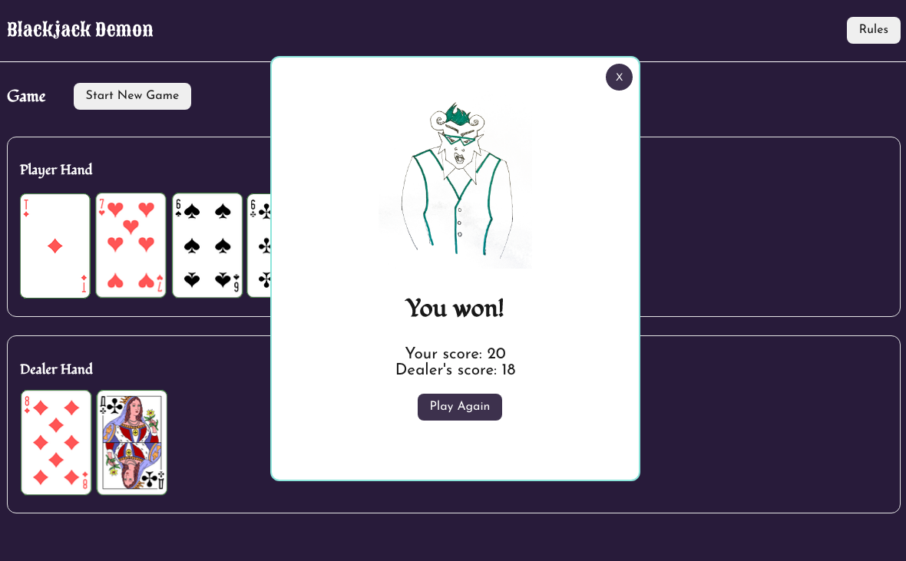
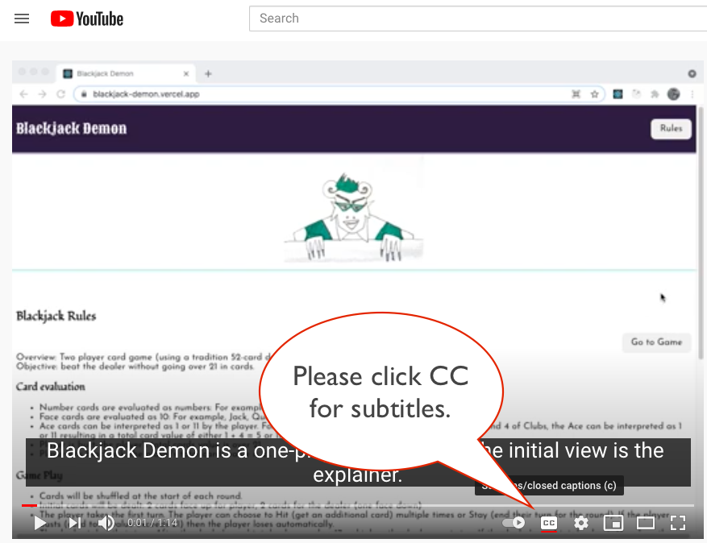

# Blackjack Demon Readme

This is a solution to the (Mintbean card game challenge)[https://mintbean.io/meets/7e2331fb-1e0d-4b31-86b9-a46acad877af].

## Table of contents

- [Overview](#overview)
  - [The challenge](#the-challenge)
  - [Screenshot](#screenshot)
  - [Links](#links)
- [Install/Run locally](#Install/Run)
- [My process](#my-process)
  - [Built with](#built-with)
  - [What I learned](#what-i-learned)
  - [Continued development](#continued-development)
  - [Useful resources](#useful-resources)
- [Author](#author)
- [Acknowledgments](#acknowledgments)

## Overview

### The challenge

Create a traditional card game as web app. I chose blackjack with one stack of cards (52 cards) and simple rules (no betting, no doubling down, no splitting). This is a one-player game where the player is challenging a dealer (bot).

[My game rules](https://github.com/cch5ng/blackjack-demon/blob/main/src/components/Rules.js)

[Additional requirements](https://info.mintbean.io/hiring-hackathon-guide)

### Screenshot




Add a screenshot of your solution. The easiest way to do this is to use Firefox to view your project, right-click the page and select "Take a Screenshot". You can choose either a full-height screenshot or a cropped one based on how long the page is. If it's very long, it might be best to crop it.

Alternatively, you can use a tool like [FireShot](https://getfireshot.com/) to take the screenshot. FireShot has a free option, so you don't need to purchase it. 

Then crop/optimize/edit your image however you like, add it to your project, and update the file path in the image above.

**Note: Delete this note and the paragraphs above when you add your screenshot. If you prefer not to add a screenshot, feel free to remove this entire section.**

### Links

- [Solution URL:](https://github.com/cch5ng/blackjack-demon)
- [Live Site URL:](http://blackjack-demon.vercel.app/)
- [Social Media:](https://youtu.be/pdALezNWw1s)

* Please turn on Youtube subtitles (clicking the CC on the controls) for short explanations.

## Install/Run

* Clone the project from https://github.com/cch5ng/blackjack-demon

* Install required files from the project root. (Node v14.16 used)

```
cd blackjack-demon
npm install
```

* Run the project.

```
npm start
```


## My process

### Built with

- Semantic HTML5 markup
- CSS custom properties
- Flexbox
- Mobile-first workflow
- [Create React App](https://github.com/facebook/create-react-app)
- [React](https://reactjs.org/) - JS library
- [react-responsive-spritesheet](https://www.npmjs.com/package/react-responsive-spritesheet) - React library for using spritesheet graphics
- [Gimp](https://www.gimp.org/) - Gimp graphics editor
- [Google web fonts](https://fonts.google.com/) - Google Web Fonts
- [color-hex](https://www.color-hex.com/) - Color Hex Color Codes

### What I learned

* Originally I tried for the Full Stack version and got client-side Firebase authentication running. But I felt behind on schedule so I switched to Front-end only. I got exposure to Firebase but can continue learning.

* I had to spend a bit of time troubleshooting a timing issue in useEffect() during the state where it is the dealer's turn to play. I had to create a workaround for tracking the dealer's cards within the game logic because the state was not getting updated as quickly as expected in the logic. It is something to continue looking at.

* This is more of a reminder but I think I spent way more time testing than actually coding. So just a reminder about the importance of going through a wide set of test cases.

### Continued development

Some areas for improvement:

* There is some redundancy with a couple of functions in the game engine (copied into the useEffect() call because of function dependencies), which could be cleaned up (but they are called outside of useEffect() as well).

* The game play moves very quickly so some timeouts might be added to make the card dealing actions more similar to human-scale timing.

* Exploring more separation of business logic vs display. There are a lot of functions in the game engine and many of the functions impact state so they were included in the Game component but for more extensive automated testing, more of the functions might be moved to a separate utilities file. Mainly extensive manual testing was done.

* Some animations might be added as responses to events like Blackjack or going bust.

* (enhancement) Support for additional players.

* (enhancement) Support for betting.

### Useful resources

- [react-responsive-spritesheet](https://www.npmjs.com/package/react-responsive-spritesheet) - This library saved me a bit of time with using a single graphic of a card set online (vs recreating cards or having to separate them manually). It was a dated library though and so a little buggy with handling a spritesheet with multiple rows of images.
- [https://www.techwalla.com/articles/how-to-replace-color-in-gimp-2](https://www.techwalla.com/articles/how-to-replace-color-in-gimp-2) - Used to change the card background colors.
- [https://pixabay.com/vectors/atlasnye-deck-playing-cards-game-884206/](https://pixabay.com/vectors/atlasnye-deck-playing-cards-game-884206/) - Converted to be used as spritesheet for card graphics.


## Author

- Website - [Carol Chung](http://www.carolchung.com)
- Blog - [https://carolchung-eng.tumblr.com](https://carolchung-eng.tumblr.com)

## Acknowledgments

This README template came from a [Frontend Mentor project](https://www.frontendmentor.io/). When I was first getting into programming, I took a Python course (series) on Coursera by Rice University. We learned programming through creating games and that experience was helpful to this project and the way I think about programming. The course was revised but [this is the starting course](https://www.coursera.org/learn/interactive-python-1) and the instructors were John Greiner, Stephen Wong, Scott Rixner, and Joe Warren.

//////

# Getting Started with Create React App

This project was bootstrapped with [Create React App](https://github.com/facebook/create-react-app).

## Available Scripts

In the project directory, you can run:

### `npm start`

Runs the app in the development mode.\
Open [http://localhost:3000](http://localhost:3000) to view it in the browser.

The page will reload if you make edits.\
You will also see any lint errors in the console.

### `npm test`

Launches the test runner in the interactive watch mode.\
See the section about [running tests](https://facebook.github.io/create-react-app/docs/running-tests) for more information.

### `npm run build`

Builds the app for production to the `build` folder.\
It correctly bundles React in production mode and optimizes the build for the best performance.

The build is minified and the filenames include the hashes.\
Your app is ready to be deployed!

See the section about [deployment](https://facebook.github.io/create-react-app/docs/deployment) for more information.

### `npm run eject`

**Note: this is a one-way operation. Once you `eject`, you can’t go back!**

If you aren’t satisfied with the build tool and configuration choices, you can `eject` at any time. This command will remove the single build dependency from your project.

Instead, it will copy all the configuration files and the transitive dependencies (webpack, Babel, ESLint, etc) right into your project so you have full control over them. All of the commands except `eject` will still work, but they will point to the copied scripts so you can tweak them. At this point you’re on your own.

You don’t have to ever use `eject`. The curated feature set is suitable for small and middle deployments, and you shouldn’t feel obligated to use this feature. However we understand that this tool wouldn’t be useful if you couldn’t customize it when you are ready for it.

## Learn More

You can learn more in the [Create React App documentation](https://facebook.github.io/create-react-app/docs/getting-started).

To learn React, check out the [React documentation](https://reactjs.org/).

### Code Splitting

This section has moved here: [https://facebook.github.io/create-react-app/docs/code-splitting](https://facebook.github.io/create-react-app/docs/code-splitting)

### Analyzing the Bundle Size

This section has moved here: [https://facebook.github.io/create-react-app/docs/analyzing-the-bundle-size](https://facebook.github.io/create-react-app/docs/analyzing-the-bundle-size)

### Making a Progressive Web App

This section has moved here: [https://facebook.github.io/create-react-app/docs/making-a-progressive-web-app](https://facebook.github.io/create-react-app/docs/making-a-progressive-web-app)

### Advanced Configuration

This section has moved here: [https://facebook.github.io/create-react-app/docs/advanced-configuration](https://facebook.github.io/create-react-app/docs/advanced-configuration)

### Deployment

This section has moved here: [https://facebook.github.io/create-react-app/docs/deployment](https://facebook.github.io/create-react-app/docs/deployment)

### `npm run build` fails to minify

This section has moved here: [https://facebook.github.io/create-react-app/docs/troubleshooting#npm-run-build-fails-to-minify](https://facebook.github.io/create-react-app/docs/troubleshooting#npm-run-build-fails-to-minify)
